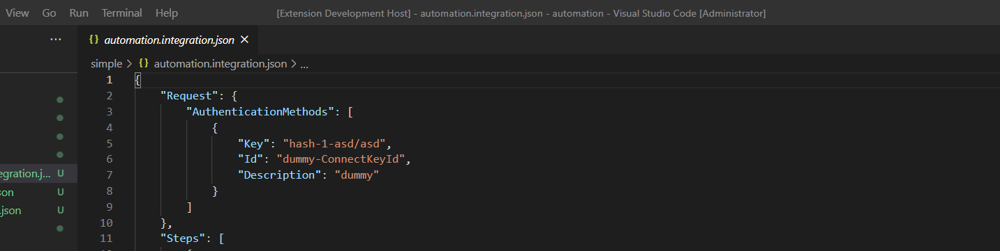
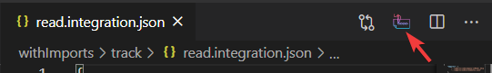
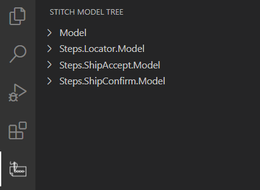

# vscode-stitch

This is a vscode extension to help with creating, testing and debugging Stitch integration files.

To get started open the *Command Palette* (`Ctrl`+`Shift`+`P`) and search for `Stitch: Preview`

Once the command is executed the Preview window appears to the right of your current open document.



Another way to start the preview is opening a `*.integration.json` file and clicking the icon in the titlebar.



## Scriban templates

When the preview is activated, the **Stitch Model Tree** view becomes visible, use this to gain access to the model properties in your [Scriban](https://github.com/scriban/scriban) templates.



By extending the tree items, and clicking on the desired node, that property is inserted to the current Text Document.

A inserted property looks like `{{Model.MyProperty}}`

## Hashes

To secure an integration a `Hash` needs to be created, which functions as an access key.

You can create a hash using the *Command Palette* (`Ctrl`+`Shift`+`P`) and searching for `Stitch: Create Hash`.

After you entered the value, the hash is copied to your `clipboard`.

## Secrets

Passwords (or other sensitive data) should not be stored as plain text in the integration, that's where `Secrets` are used.

> A secret is environment specific!

You can create a secret using the *Command Palette* (`Ctrl`+`Shift`+`P`) and searching for `Stitch: Create Secret`.

After you chose the environment and entered the value, the secret is copied to your `clipboard`.

## Basic Integration structure

A typical intregration has the following project structure:

```js
/track                        // The actual integration folder
  /scenarios                  // Predefined folder to store scenarios under
    /scenario1                // A scenario to test the integration
      - input.txt             // Input for the request
      - step.*.txt            // Response for step with Id *
  - track.integration.json    // Integration definition
  - request-body.json         // Scriban template for the request
  - response-body.json        // Scriban template for the response
```

## Advanced Integration structure

A more complex structure might look like:

```js
/carrier
  /imports                    // contains files shared acros integrations
    - test.json
    - acceptance.json
  /track
    /scenarios
      /sample1
        - input.txt
        - step.authenticate.txt
        - step.book.txt
      /sample2
        - input.txt
        - step.authenticate.txt
        - step.book.txt
    - track.integration.json
    - request-auth.json
    - request-book.json
    - response-body.json
  /book
    /scenarios
      /sample1
        - input.txt
        - step.authenticate.txt
        - step.book.txt
    - book.integration.json
    - request-body.json
    - response-body.json
```

Here the `track.integration.json` contains 2 steps, identified by the `Id` property. The scenario should contain a file for each defined step, which follows the naming convention `step.{Id}.txt`.

```json
// Modified example for brevity

{
    "Imports": [
        "../imports/{{Environment}}.json"
    ],
    "Request": ...,
    "Steps": [
        {
            "$type": "Core.Entities.Configs.Steps.HttpConfiguration, Core",
            "Id": "authenticate",
            "Method": "GET",
            "Url": "https://somedomain.com/api/auth",
            "Template": "{{include 'request-auth.json'}}"
        },
        {
            "$type": "Core.Entities.Configs.Steps.HttpConfiguration, Core",
            "Id": "book",
            "Method": "GET",
            "Url": "https://somedomain.com/api/book",
            "Template": "{{include 'request-book.json'}}"
        }
    ],
    "Response": {
        "Body": "{{include 'response-body.json'}}",
        "Headers": {},
        "StatusCode": 200
    }
}
```

## Extension Settings

This extension contributes the following settings:

* `stitch.endpointUrl`: set to the desired endpoint to test stitch integrations


## Release Notes

Please see the [changelog](CHANGELOG.md)!


### Acknowledgements

* Icon used by this extension - [source](https://www.flaticon.com/free-icon/stitching_3460012?term=stitch&page=2&position=70&page=2&position=70&related_id=3460012&origin=search)
* Show source icon - from [vscode-test-explorer](https://github.com/hbenl/vscode-test-explorer)

